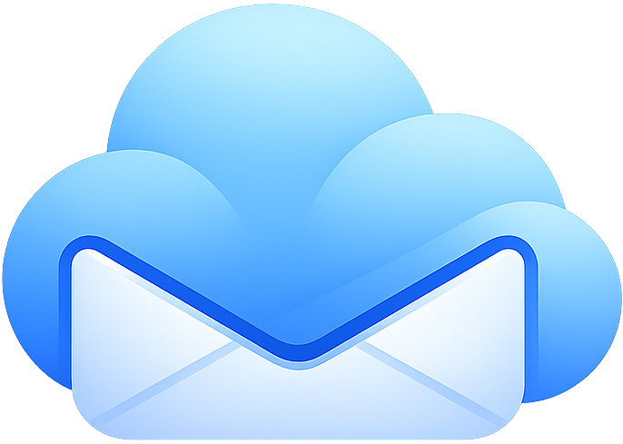
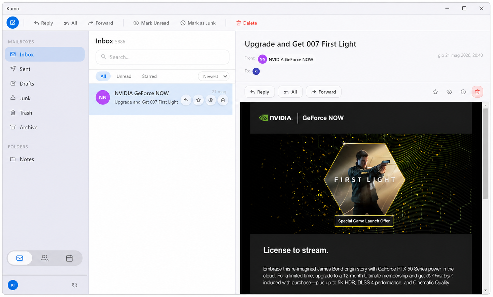

  

# Kumo — iCloud Mail for Your Desktop

---

Kumo is a desktop email application for your iCloud account. It connects directly to Apple's mail servers and lets you read, write, and organize your email, contacts, and calendar in one place — without opening a browser.

Your messages are stored on your device and always available, even when you are not connected to the internet.

  

---

## System Requirements

- **Windows:** Windows 10 (version 1903 or later) or Windows 11
- **iCloud account:** Any Apple ID with iCloud Mail enabled (an `@icloud.com`, `@me.com`, or `@mac.com` address)
- **Apple ID two-factor authentication:** Must be turned on (required by Apple to generate app-specific passwords)
- **Internet connection:** Required for sending and receiving new mail; previously downloaded mail is available offline

---

## Installation

1. Download the latest Kumo installer from the [Releases page](https://github.com/shosa/Kumo/releases).
2. Double-click the downloaded `.exe` file.
3. If Windows shows a "Windows protected your PC" warning, click **More info**, then click **Run anyway**. This warning appears because the app is not yet signed with a paid certificate.
4. Follow the on-screen prompts to complete the installation.
5. Launch Kumo from the Start menu or the desktop shortcut.

---

## iCloud Setup — Generating an App-Specific Password

> **This step is required.** Apple does not allow third-party apps to use your regular Apple ID password. You must generate a special one-time password called an **app-specific password** before Kumo can connect to your account.

### Why is this needed?

Apple's security policy requires that apps outside Apple's own ecosystem use a dedicated password rather than your main Apple ID password. This protects your account — even if Kumo were compromised, your main Apple ID password would remain safe.

### How to generate your app-specific password

1. Open a web browser and go to **[appleid.apple.com](https://appleid.apple.com)**.
2. Sign in with your Apple ID and complete two-factor authentication when prompted.
3. Scroll down to the **Sign-In and Security** section and click **App-Specific Passwords**.
4. Click the **+** (plus) button or **Generate an App-Specific Password**.
5. Type a label for this password, for example: `Kumo Mail`. Then click **Create**.
6. Apple will show you a password in the format `xxxx-xxxx-xxxx-xxxx`. **Copy this password now.** Apple will not show it again.
7. Keep this browser tab open while you set up Kumo, then you can close it.

> **Keep your app-specific password private.** Do not share it with anyone. If you believe it has been compromised, go back to appleid.apple.com, find the password in the App-Specific Passwords list, and revoke it. You can then generate a new one for Kumo.

---

## First Launch Walkthrough

When you open Kumo for the first time, you will see the sign-in screen.

1. **Email address** — Type your full iCloud email address (for example, `yourname@icloud.com`).
2. **App-specific password** — Paste the password you generated at appleid.apple.com (the `xxxx-xxxx-xxxx-xxxx` format).
3. Click **Sign In**.

Kumo will connect to Apple's mail servers. This may take 10–30 seconds on the first login, depending on how many emails are in your inbox. A progress indicator will appear at the bottom of the sidebar.

Once connected, your inbox will appear with your most recent messages. Kumo will continue receiving new mail automatically in the background as long as it is running.

**What you see:**
- **Left sidebar** — Your mailboxes (Inbox, Sent, Drafts, Trash, Junk, and any custom folders you have created in iCloud).
- **Middle column** — The list of messages in the selected folder.
- **Right pane** — The full content of the selected message.
- **Bottom of the sidebar** — Tabs to switch between Mail, Contacts, and Calendar.

---

## Known Limitations

The following features are not yet available in this version of Kumo:

- **Sending email is currently unavailable** due to a bug being fixed. This will be resolved in the next release.
- **Drafts are stored on this device only.** They will not appear in Apple Mail, iCloud.com, or on other devices.
- **No folder creation or renaming.** You can view and use existing folders from your iCloud account, but you cannot create new ones inside Kumo. Use iCloud.com or Apple Mail to create folders.
- **Calendar events in some time zones may display at the wrong time.** Events with a specific city/region time zone (for example, events created in New York time from an iPhone) may show at a slightly wrong time on this device if its clock is set to a different time zone.
- **Contacts and calendar sync is one-way (read-only).** You can view your iCloud contacts and calendar events, but you cannot add, edit, or delete them from within Kumo.
- **Remote images in emails are blocked by default** for privacy. You can load images for individual emails by clicking the "Load Images" button that appears above the message.
- **No rules, filters, or auto-responders.**
- **No PGP/S-MIME encrypted mail** support.
- **Only iCloud accounts are supported.** Gmail, Outlook, and other providers are not supported.

---

## Troubleshooting

### 1. "Connection failed" error at sign-in

**Most likely cause:** You entered your regular Apple ID password instead of an app-specific password.

**Fix:** Go to [appleid.apple.com](https://appleid.apple.com), generate a new app-specific password (see the iCloud Setup section above), and try again. Your regular Apple ID password will never work here — this is Apple's policy for third-party apps.

---

### 2. Kumo connected but my inbox is empty

**Most likely cause:** Kumo limits the initial download to your 200 most recent messages to keep the first launch fast. Older messages are not shown until you scroll down to load more.

**Fix:** Scroll to the bottom of the message list and click **Load More**, or wait for the sync to complete. The total message count is shown next to the folder name.

---

### 3. New emails are not appearing

**Most likely cause:** The connection to Apple's servers was interrupted.

**Fix:**
- Check that you have an active internet connection.
- Click the refresh button (circular arrow) at the bottom-left of the sidebar to manually check for new mail.
- If the connection indicator shows "Reconnecting…", wait a moment — Kumo reconnects automatically.
- If the problem persists, sign out (click your avatar at the bottom of the sidebar → Sign Out) and sign in again.

---

### 4. My app-specific password stopped working

**Most likely cause:** Apple automatically revokes app-specific passwords when you change your Apple ID password, or you manually revoked it at appleid.apple.com.

**Fix:** Generate a new app-specific password at [appleid.apple.com](https://appleid.apple.com), then sign out of Kumo and sign back in with the new password.

---

### 5. Contacts or calendar events are missing or out of date

**Most likely cause:** Contacts and calendar data are not synced automatically — you must trigger a manual sync.

**Fix:** Switch to the Contacts or Calendar tab using the icons at the bottom of the sidebar. Look for a **Sync** button and click it. The sync may take up to a minute depending on the number of contacts and events in your account.

---

## Frequently Asked Questions

**Q: Is my password stored on my device?**
A: Yes, your app-specific password is stored in your operating system's secure credential storage (Windows Credential Manager). It is encrypted and only accessible by Kumo on this device. It is never sent to any server other than Apple's own mail servers.

**Q: Can I use Kumo with a Gmail, Outlook, or Yahoo account?**
A: No. Kumo is designed specifically for iCloud accounts. Support for other mail providers is not planned at this time.

**Q: Can I have more than one iCloud account?**
A: Not in this version. Kumo currently supports one iCloud account at a time.

**Q: Does Kumo work without an internet connection?**
A: Partially. Emails that have already been downloaded are readable offline. New emails cannot be received and you cannot send mail while offline. The app will reconnect and sync automatically when your connection is restored.

**Q: Why do I need two-factor authentication on my Apple ID?**
A: Apple requires two-factor authentication to be enabled before you can generate app-specific passwords. If you do not have two-factor authentication turned on, go to [appleid.apple.com](https://appleid.apple.com) → Sign-In and Security → Two-Factor Authentication and follow the setup steps. This is a one-time setup that Apple requires for account security.

**Q: What happens if I delete a message in Kumo? Can I undo it?**
A: Deleting a message moves it to your iCloud Trash folder. It will remain there until you empty the trash (right-click the Trash folder → Empty Trash) or until iCloud automatically removes it (typically after 30 days). You can recover a deleted message by opening the Trash folder and moving it back to your inbox.

**Q: Why does Kumo show a Windows security warning on install?**
A: This warning ("Windows protected your PC") appears because the installer does not yet have a paid code-signing certificate. The app is safe to install. Click "More info" and then "Run anyway" to proceed.

**Q: My notification showed someone else's name/avatar. What happened?**
A: This is a known visual glitch when multiple emails arrive at the same time. It does not affect the actual delivery or reading of your email. This will be corrected in a future update.

---

## Privacy Statement

Kumo connects directly between your device and Apple's iCloud mail, contacts, and calendar servers (imap.mail.me.com, smtp.mail.me.com, contacts.icloud.com, caldav.icloud.com). No data is routed through any intermediate server operated by the Kumo developers. Your email content, contacts, and calendar events are downloaded directly to your device and stored in a local database in your user data folder. Your app-specific password is encrypted and stored locally using Windows Credential Manager — it is never transmitted to any party other than Apple. The app does not collect analytics, does not send telemetry, and does not contact any server other than Apple's own infrastructure.

---

## Reporting Bugs

If you encounter a problem, please open an issue at:

**[https://github.com/shosa/Kumo/issues](https://github.com/shosa/Kumo/issues)**

When reporting, please include:
- A description of what you expected to happen and what actually happened
- The steps to reproduce the problem
- Your Windows version (Settings → System → About → Windows specification)
- Whether the problem happens every time or only sometimes

Do **not** include your email address, your app-specific password, or any private email content in your report.

---

Built with [Electron](https://electronjs.org) · [React](https://reactjs.org) · [imapflow](https://imapflow.com) · [Tiptap](https://tiptap.dev) · [sql.js](https://sql.js.org) · [nodemailer](https://nodemailer.com)

